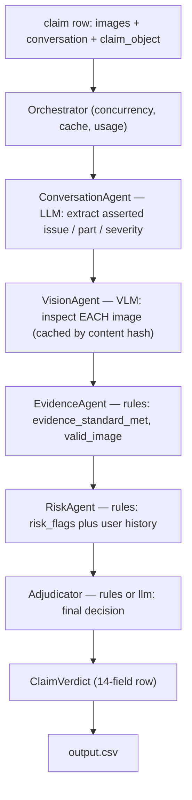
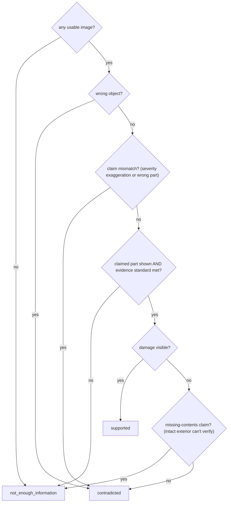
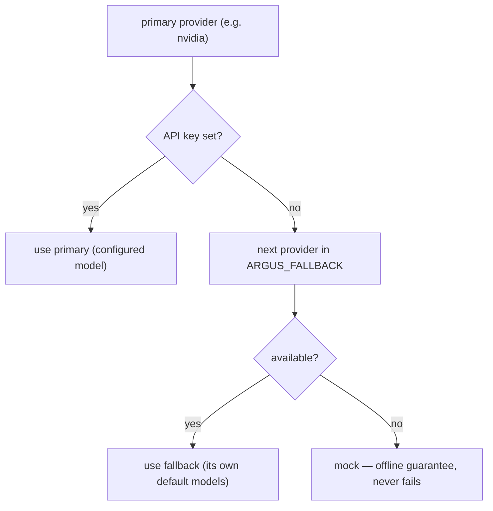
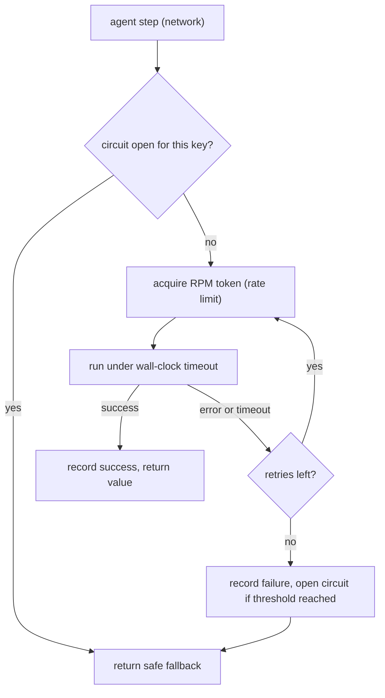

# Argus — Multi-Modal Evidence Review

> *Argus Panoptes, the all-seeing hundred-eyed guardian of Greek myth — many eyes
> (many images, many specialist agents) cooperating to reach one verdict.*

Argus verifies damage claims (`car`, `laptop`, `package`) by orchestrating a team
of specialist agents over the submitted **images** (the primary source of truth),
the **claim conversation**, the user's **claim history**, and the **minimum
evidence requirements**. For each row in `dataset/claims.csv` it emits one row of
`output.csv` with the exact 14-field schema in `problem_statement.md`.

It runs **offline with no API key** (deterministic `mock` provider) so the whole
pipeline, caching, and evaluation are reproducible — then flip one env var for
real VLM grounding (Anthropic / OpenAI / NVIDIA).

### Highlights

- **Multi-agent pipeline** — claim extraction, per-image vision, evidence, risk,
  and adjudication as separate, individually-testable agents.
- **Images are the source of truth** — vision findings are objective; user
  history only adds risk context, it never overrides clear visual evidence.
- **Provider-agnostic** — `mock` | `anthropic` | `openai` | `nvidia`, with an
  automatic **fallback chain** so a missing key never kills a run.
- **Resilience harness** around every agent step — rate limiting, circuit
  breaking, timeouts, retries, and error isolation.
- **Deterministic & reproducible** — `temperature=0`, content-hash vision cache,
  rule-based decisions; **74 tests**, built test-first.
- **Cost-aware** — image downscaling, prompt caching, per-image cache, and a
  cheap text model for extraction. A full test pass is well under a few dollars.

### Results (20 labeled samples · gpt-4o vision · `rules`)

| metric | baseline | after tuning |
|---|---|---|
| claim_status accuracy | 0.700 | **0.800** |
| claim_status macro-F1 | 0.583 | **0.689** |
| severity | 0.300 | **0.450** |
| valid_image | 0.850 | **0.900** |

Full breakdown, tuning log, model comparison, and the operational/cost analysis
are in [`evaluation/evaluation_report.md`](evaluation/evaluation_report.md).

---

## Contents

1. [Architecture](#architecture)
2. [How a claim flows](#how-a-claim-flows)
3. [Quickstart](#quickstart)
4. [Evaluation](#evaluation)
5. [Tests](#tests)
6. [Configuration](#configuration)
7. [Provider fallback](#provider-fallback)
8. [Resilience harness](#resilience-harness)
9. [Layout](#layout)
10. [Packaging for submission](#packaging-for-submission)

---

## Architecture

```
                 ┌──────────────────────────────────────────────┐
   claim row ───▶│                Orchestrator                   │
 (csv + images)  │  (concurrency · cache · usage · harness)      │
                 └───┬───────────┬───────────┬──────────┬────────┘
                     ▼           ▼           ▼          ▼
            ConversationAgent  VisionAgent  EvidenceAgent  RiskAgent
              (LLM, text)      (VLM, /image)  (rules)       (rules)
                     │           │           │          │
                     └───────────┴─────┬─────┴──────────┘
                                       ▼
                                  Adjudicator           ──▶  ClaimVerdict ──▶ output.csv
                              (rules | llm strategy)
```

- **ConversationAgent** — extracts the *asserted* claim (issue, part, severity)
  from the chat. Handles English / Hindi / Hinglish. (LLM; keyword fallback offline.)
- **VisionAgent** — inspects each image **objectively** (object, parts, visible
  damage, quality, authenticity, embedded-instruction text). Cached by image
  content hash. (VLM.)
- **EvidenceAgent** — applies `evidence_requirements.csv` to the findings to set
  `evidence_standard_met` / `valid_image`. (Deterministic.)
- **RiskAgent** — fuses image-quality, authenticity, claim-mismatch, and
  user-history signals into `risk_flags`. (Deterministic.)
- **Adjudicator** — final `claim_status`, `issue_type`, `object_part`,
  `severity`, `supporting_image_ids`, and justification. Two interchangeable
  strategies: `rules` (default, reproducible) and `llm`.

**Design principle:** the *visual reading* is the only part that needs a VLM, so
it is isolated in one agent and cached; everything downstream is deterministic
policy that can be audited, tested, and reproduced exactly.

---

## How a claim flows

Each claim runs the agents in sequence; every step is wrapped by the
[resilience harness](#resilience-harness).



### Adjudicator decision logic (`rules`)



---

## Quickstart

```bash
pip install -r code/requirements.txt
cp code/.env.example code/.env      # optional; defaults to the offline mock provider

# Offline (no key) — produces output.csv for all of dataset/claims.csv:
python code/main.py

# Quick smoke test on 5 labeled rows:
python code/main.py --sample --limit 5

# Real VLM grounding:
export ANTHROPIC_API_KEY=sk-ant-...     # or OPENAI_API_KEY / NVIDIA_API_KEY; never commit
ARGUS_PROVIDER=anthropic python code/main.py --output output.csv
```

`python code/main.py` writes `<repo>/output.csv` (override with `--output`).
`--sample` runs `dataset/sample_claims.csv` and writes `sample_output.csv`.

---

## Evaluation

```bash
python code/evaluation/main.py                       # compare strategies, write evaluation_metrics.md
python code/evaluation/main.py --strategies rules    # single strategy (halves model calls)
```

See [`evaluation/evaluation_report.md`](evaluation/evaluation_report.md) for
metrics, the strategy/model comparison, and the operational analysis (calls,
tokens, cost, latency, rate limits, batching/caching/retry).

---

## Tests

```bash
pip install pytest
python -m pytest code/tests -q        # 74 tests, offline (no API key)
```

The deterministic core (vocab coercion, evidence/risk rules, the adjudication
decision tree, metrics, CSV/image I/O, the fallback chain, and the resilience
harness) is unit-tested, plus an end-to-end test that runs the mock pipeline on
the real samples and asserts every emitted value is in the allowed vocabulary and
that history-derived flags match `user_history.csv`. Behaviour changes are made
test-first (red → green).

---

## Configuration

All env-overridable; see [`.env.example`](.env.example). Secrets are read from
the environment only — never hardcoded.

| var | default | meaning |
|---|---|---|
| `ARGUS_PROVIDER` | `mock` | `mock` \| `anthropic` \| `openai` \| `nvidia` |
| `ARGUS_VISION_MODEL` | provider default | per-image VLM (`claude-opus-4-8`, `gpt-4o`, `meta/llama-3.2-90b-vision-instruct`, …) |
| `ARGUS_REASONING_MODEL` | provider default | cheap text model for claim extraction |
| `ARGUS_ADJUDICATOR` | `rules` | `rules` \| `llm` |
| `ARGUS_FALLBACK` | `openai,anthropic,mock` | provider fallback chain (see below) |
| `ARGUS_MAX_IMAGE_EDGE` | `1024` | downscale long edge (image-token control) |
| `ARGUS_MAX_WORKERS` | `4` | concurrent claims |
| `ARGUS_RPM` | `0` (unlimited) | rate-limit model calls/minute (resilience harness) |
| `ARGUS_STEP_TIMEOUT` / `ARGUS_STEP_RETRIES` | `180` / `2` | per-agent-step wall-clock cap + step retries |
| `ARGUS_CIRCUIT_THRESHOLD` / `ARGUS_CIRCUIT_RESET` | `5` / `30` | circuit breaker: open after N step failures, cooldown (s) |
| `ARGUS_VISION_CACHE` / `ARGUS_PROMPT_CACHE` | on | content-hash + prompt caching |

---

## Provider fallback

If the selected provider has no API key (or fails at runtime), Argus
automatically falls back to the next available provider, ending in the offline
`mock` so a run never just dies. Example: choose `nvidia` without an `nvapi-` key
but with `OPENAI_API_KEY` set, and it runs on OpenAI.



```bash
python code/main.py --provider nvidia      # -> "[argus] provider 'nvidia' unavailable; using fallback chain"
                                            #    runs on openai; usage shows provider="openai>mock"
```

Order is `ARGUS_FALLBACK` (default `openai,anthropic,mock`). Each fallback uses
its own provider-appropriate model ids. Every fallback is logged to stderr (and
shown in the usage summary's `provider` field), so a degraded run is never
silent. Set `ARGUS_FALLBACK=openai` (no `mock`) to disable the offline net and
fail loudly instead.

---

## Resilience harness

Every agent step runs through `argus/harness.py` (`ResilienceHarness`). For
**network steps** (conversation, vision, LLM adjudicator) it adds a shared **RPM
rate limiter** (token bucket), a per-key **circuit breaker**, a per-step
**wall-clock timeout**, and **step-level retries** with backoff. **Deterministic
steps** (evidence, risk, rule adjudicator) get **error isolation** only. On total
failure a step returns a safe fallback (empty analysis / unusable image /
`not_enough_information` verdict) so one bad step never crashes a claim. The run's
`usage` summary reports harness counters (`attempts`, `retries`, `timeouts`,
`failures`, `circuit_skips`).



This sits above the SDK's own network retries and the
[provider fallback chain](#provider-fallback) — three independent layers of
resilience.

---

## Layout

```
code/
├── main.py                      # entry point: claims.csv -> output.csv
├── requirements.txt
├── .env.example
├── argus/
│   ├── config.py                # env-driven settings
│   ├── constants.py             # allowed vocab + issue->evidence-family mapping
│   ├── schemas.py               # pydantic models (structured agent I/O)
│   ├── data_io.py               # CSV + image-path I/O
│   ├── imaging.py               # load + downscale + hash images
│   ├── cache.py                 # disk-backed per-image vision cache
│   ├── harness.py               # ResilienceHarness: rate limit, circuit, timeout, retries
│   ├── orchestrator.py          # wires agents + harness, concurrency, usage
│   ├── llm/                     # provider-agnostic backends + fallback
│   │   ├── base.py · factory.py · fallback.py
│   │   └── mock_backend.py · anthropic_backend.py · openai_backend.py · nvidia_backend.py
│   └── agents/                  # conversation · vision · evidence · risk · adjudicator
├── evaluation/
│   ├── main.py                  # strategy comparison on the labeled set
│   ├── metrics.py               # scoring
│   ├── evaluation_report.md     # metrics + operational/cost analysis
│   └── evaluation_metrics.md    # (generated)
└── tests/                       # 74 tests (pytest), fully offline
```

No hardcoded per-case answers: the `mock` provider is a deterministic *stub* (it
parses inputs and applies the same rule layers as the real path), and all
decisions flow from the agent findings + the published rules.

---

## Packaging for submission

Zip the `code/` directory. **Exclude** `.env`, `.argus_cache/`, `__pycache__/`,
and any virtualenv (the `.gitignore` lists them, but `zip -r` won't honor that on
its own). `output.csv` (predictions) and the chat-transcript log are uploaded
separately.
